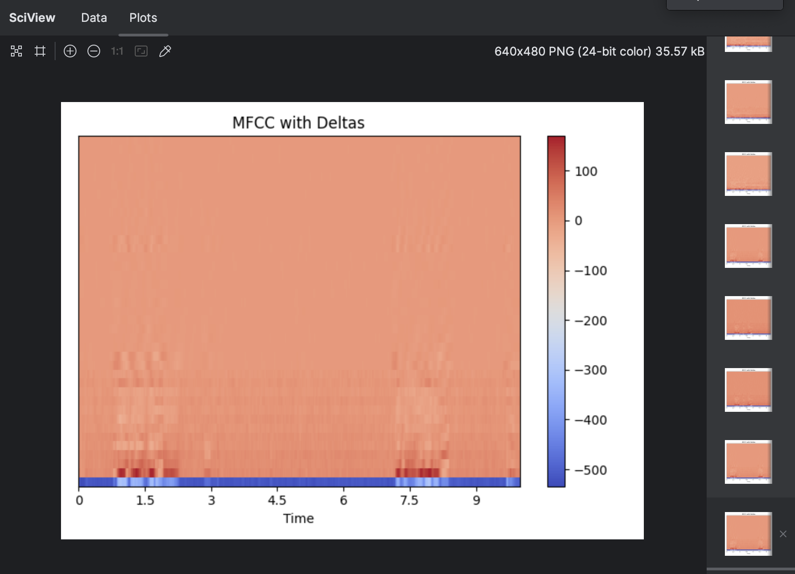
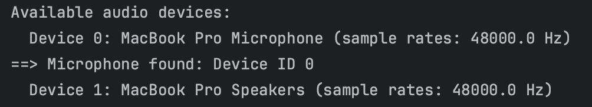
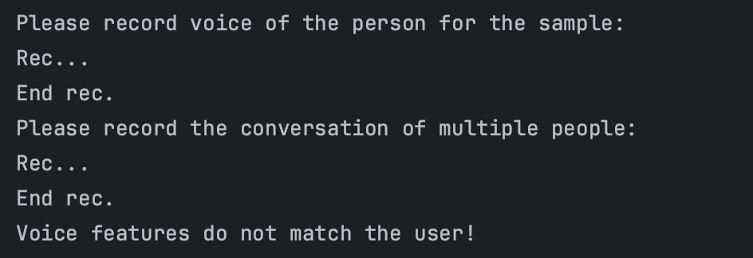
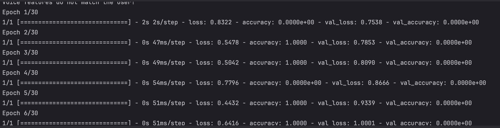
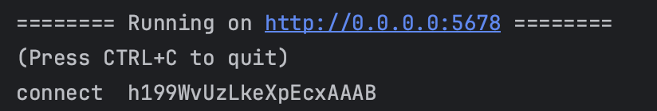

# Voice Processing and Analysis System

This project involves a comprehensive voice processing and analysis system implemented in Python. It includes functionalities for recording audio, processing and extracting features, comparing voice samples, and training a machine learning model for voice recognition.

## Features

- **Audio Recording:** Record audio samples using the `sounddevice` library.
- **Noise Addition:** Add Gaussian noise to audio samples for robustness.
- **Feature Extraction:** Extract MFCC (Mel-Frequency Cepstral Coefficients) features from audio using `librosa`.
- **Voice Comparison:** Compare voice features to identify matching samples.
- **Model Training:** Train a Convolutional Neural Network (CNN) and Long Short-Term Memory (LSTM) model for voice recognition using Keras.
- **Web Server Interface:** Provide a web interface using `socketio` and `aiohttp` for real-time voice analysis.
- **Voice Identification in Group Conversations:** Identify and extract a person's voice from a group conversation.

## Dependencies

- Python 3.x
- Numpy
- Sounddevice
- Matplotlib
- Scipy
- Librosa
- Keras
- TensorFlow
- Scikit-Learn
- Speech Recognition
- Pydub
- Aiohttp
- SocketIO
- Threading
- Asyncio

## Installation

1. Clone the repository.
2. Install the required dependencies:
   ```bash
   pip install numpy sounddevice matplotlib scipy librosa keras tensorflow scikit-learn SpeechRecognition pydub aiohttp python-socketio
    ```
   **OR**
3. Docker:
   ```bash
   docker build -t speaker-recognizer .
   ```

# Run the script:

```bash
python main.py
```

**OR docker**
```bash
docker run -p 5678:5678 speaker-recognizer
```

# Usage
#### Upon running the script:

1. The system will print the available audio devices.
2. Follow the prompts to record voice samples and group conversations.
3. The system will automatically process the recordings, extract features, and perform voice comparisons.
4. To train the model, place .wav files in the audio_training_data/ directory and run the training section of the script.
5. Access the web server interface on `http://localhost:5678/` for real-time analysis.
6. Contributing
7. Contributions to this project are welcome. Please fork the repository and submit pull requests with your enhancements.

# Running Tests
To run the tests for the application, navigate to the project directory and execute:
```bash
python -m unittest discover -s tests
```

# Screenshots
Below are various screenshots depicting different functionalities of the voice processing system:

1. ### MFCC with Deltas Visualization:

This image shows the MFCC feature extraction with delta coefficients visualized as a heatmap. Each column represents a time frame, while each row represents cepstral coefficients. The intensity of colors reflects the magnitude of the coefficient values.

2. ### Available Audio Devices:

Here we see a list of available audio devices detected by the system. The device IDs are used to select appropriate input devices for recording audio.

3. ### Recording Prompts:

The system prompts the user to record individual and group voice samples, providing clear instructions for interaction.

4. ### Model Training Progress:

The system prompts the user to record individual and group voice samples, providing clear instructions for interaction.

5. ### Voice Identification Result:

This console output captures the progress of the machine learning model training over epochs, displaying loss and accuracy metrics.

6. ### Server Running:

After processing, the system outputs the result of voice identification, indicating to which group the analyzed voice sample belongs.

# License
This project is licensed under the MIT License.

### <i>!!! IMPORTANT !!!<i>
**Note:** The system is designed for educational and research purposes and may require further modifications for production-level deployment.

## Example service frontend implementation in Angular

**web-socket.service.ts:**
```ts
import { Injectable } from '@angular/core';
import { Observable } from 'rxjs';
import io from 'socket.io-client';

@Injectable({
  providedIn: 'root'
})
export class WebSocketService {
  private socket: any
  private readonly uri: string = 'http://localhost:5678';

  constructor() {
    this.socket = io(this.uri);
  }

  public onGetResult(): Observable<string> {
    return new Observable<string>(observer => {
      this.socket.on('response', (data: string): void => {
        observer.next(data);
      });
    });
  }

  public emitGetResult(data: any): void {
    this.socket.emit('get_result', data);
  }
}
```